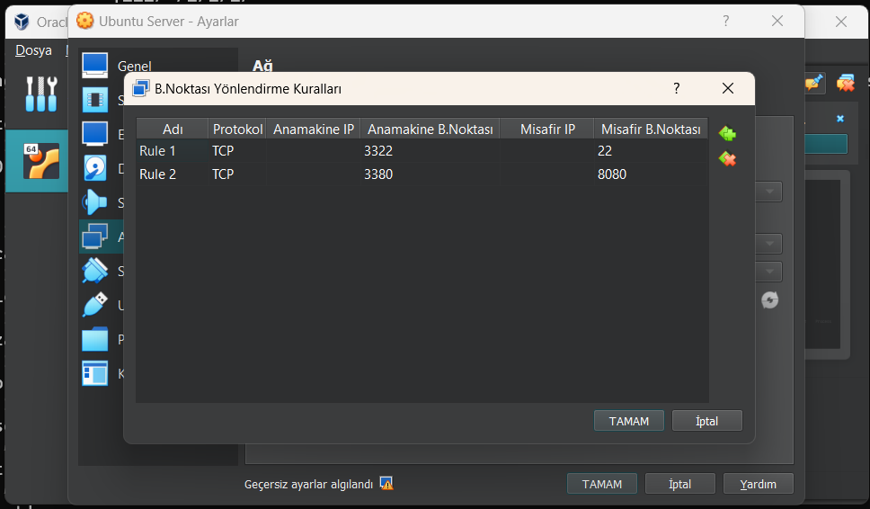
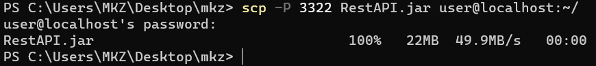
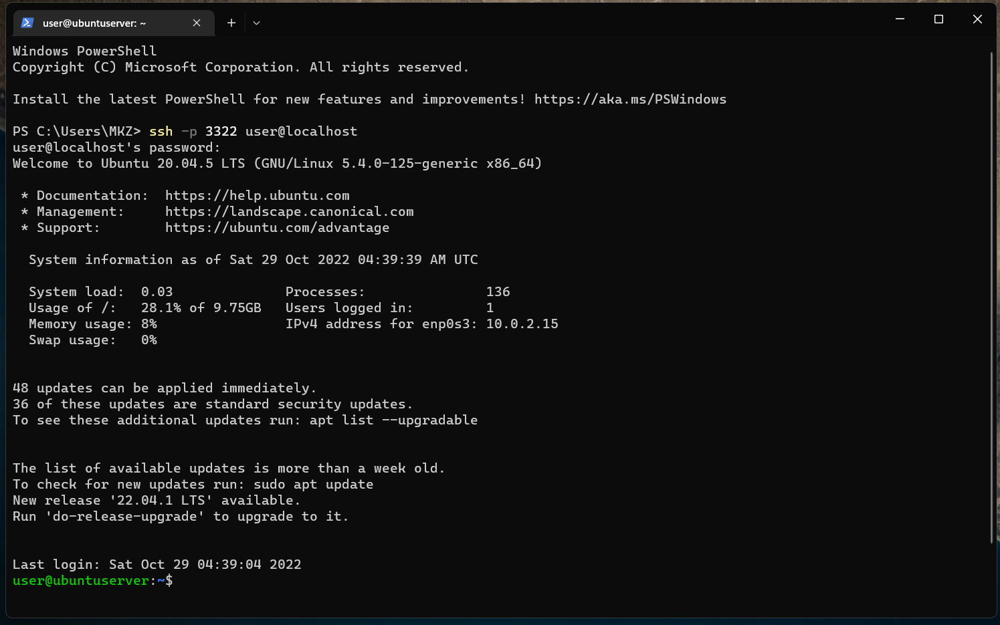
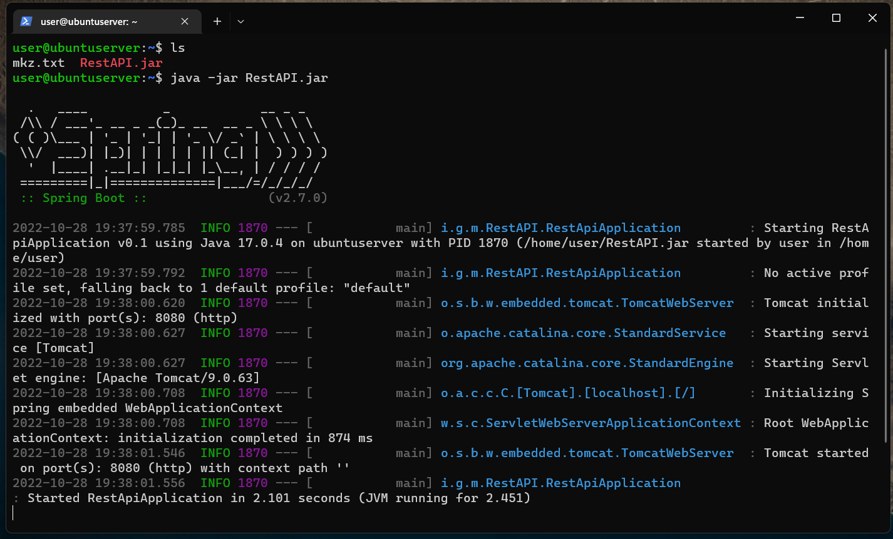
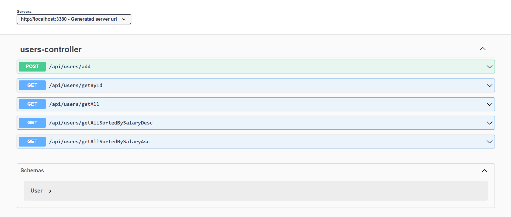
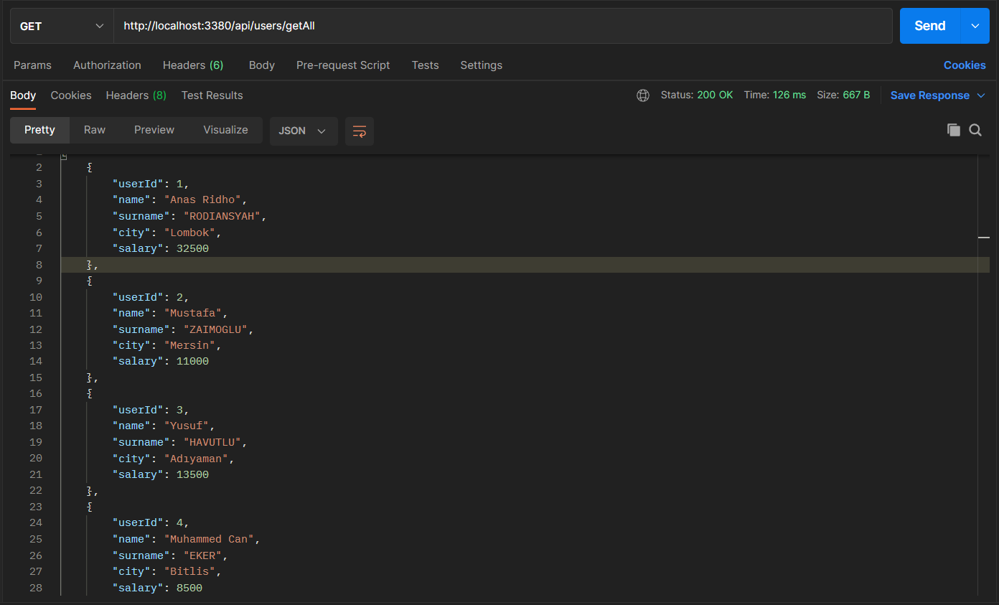
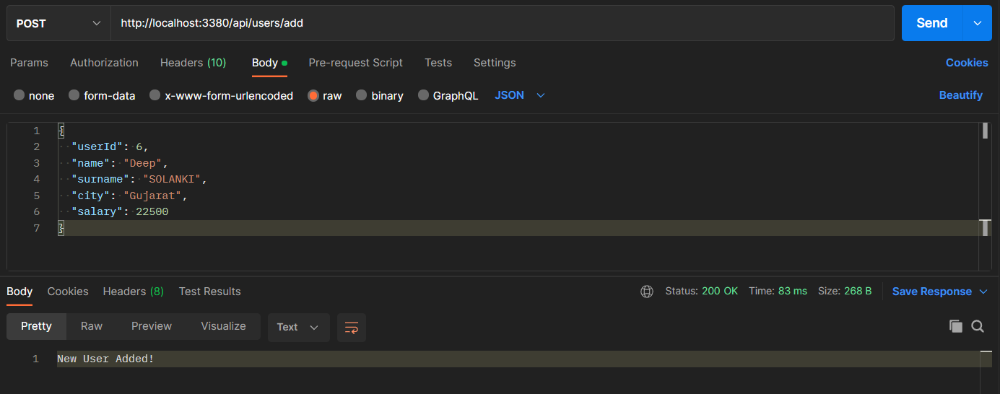
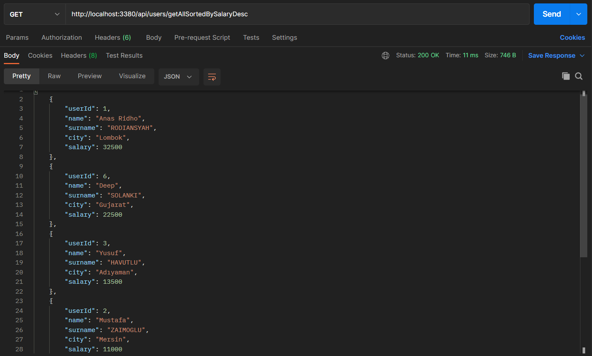

# Working With Virtual Servers

### Configuration On Virtual Box
### Port Forwarding



<br>

### Sending Jar file to virtual machine

```batch
  scp -P 3322 RestAPI.jar user@localhost:~/
```



<br>

### Connection to virtual machine

```batch
  ssh -p 3322 user@localhost
```



<br>

### Running Jar file

```batch
  Java -jar RestAPI.jar
```



<br>

### Overview of API on Swagger

```batch
  http://localhost:3380/swagger-ui/index.html
```



<br>

### Get Request On Postman

```batch
  GET localhost:3380/api/users/getAll
```



<br>

### Post Request On Postman (Adding My Indian Friend :))

```batch
  POST localhost:3380/api/users/add
```



<br>

### Get Request On Postman (Get All Sorted)

```batch
  GET localhost:3380/api/users/getAllSortedBySalaryDesc
```



##### As you can see Deep is up there on the second line!

<br>

<p style='text-align: right;'>
<strong><i>Mustafa ZAİMOĞLU</i></strong>
</p>
