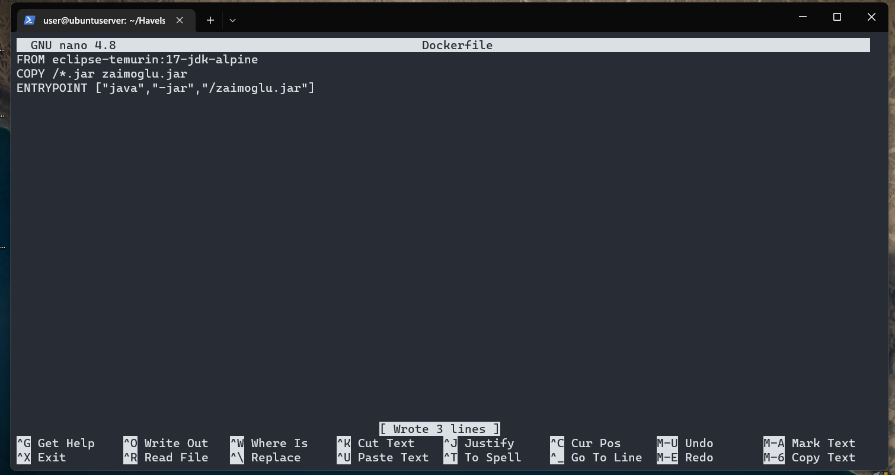
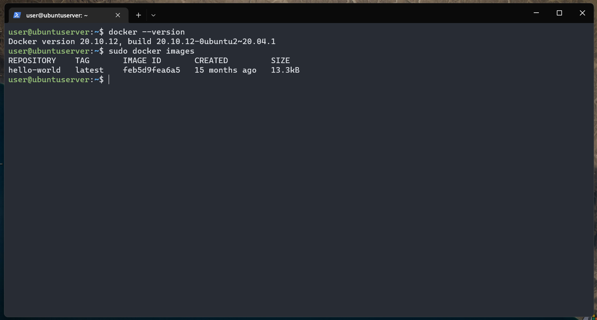
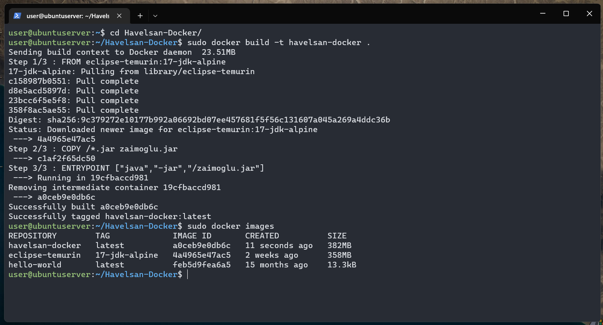
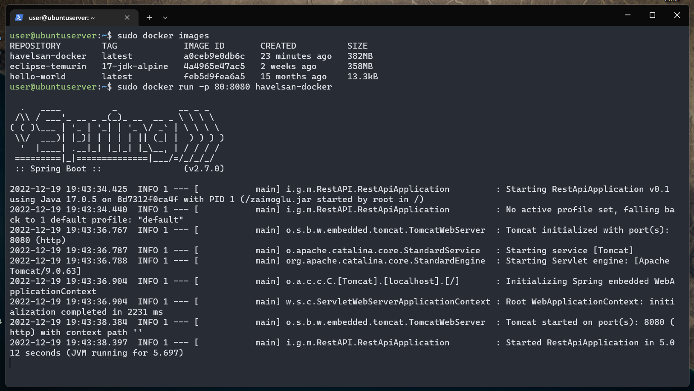
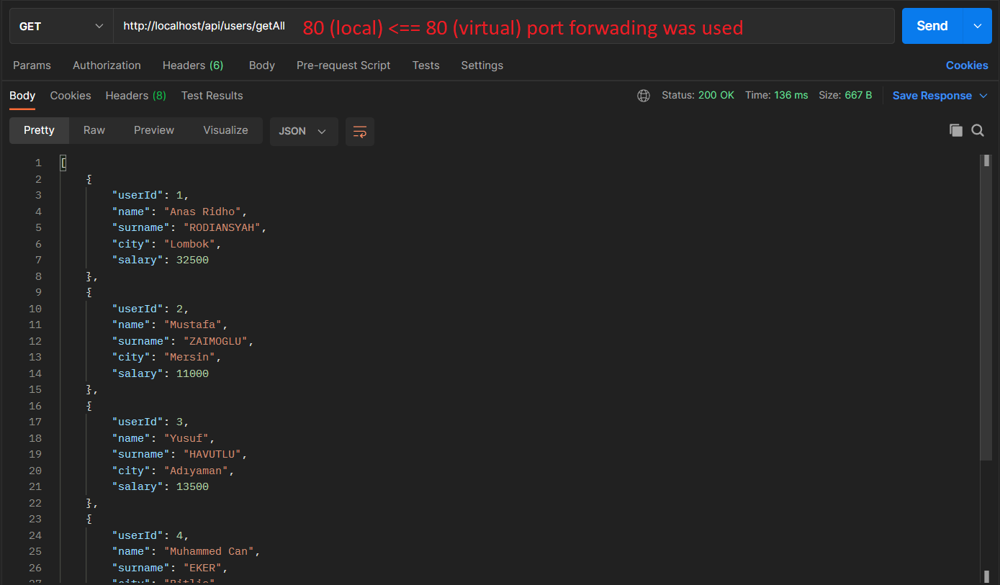

# Docker on Ubuntu Virtual Machine

### Create directory and Dockerfile 


<br>

### Configure Dockerfile



<br>

### Check Docker version and images



<br>

### Build docker image with name 'havelsan-docker'

```bash
  sudo docker build -t havelsan-docker .
```



<br>

### Run Dockerfile on port 80

```bash
  sudo docker run -p 80:8080 havelsan-docker
```



<br>

### Test the app on Postman

```batch
  GET http://localhost/api/users/getAll
```



<br>

<p align="right">
<strong><i>Mustafa ZAİMOĞLU</i></strong>
</p>
